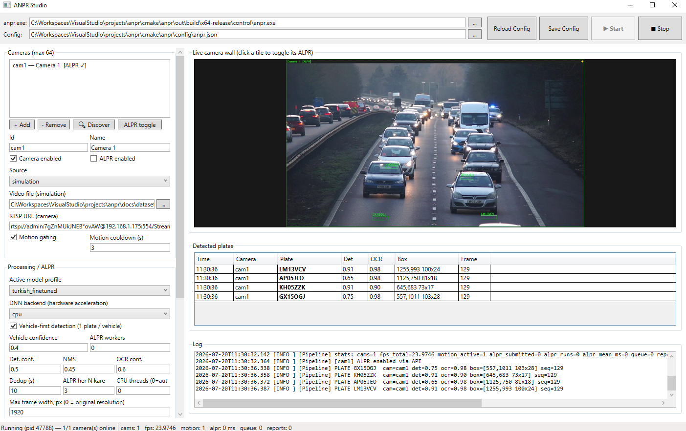

<div align="center">

# ANPR — Layered Automatic Number Plate Recognition

**Real-time, multi-camera license-plate recognition for IP cameras — built as a clean, layered, config-driven C++ system with a WPF control studio.**

[](#)
[](#)
[](#)
[](#)
[](#)
[](LICENSE)

</div>

---

ANPR ingests video from IP cameras (Hikvision and any ONVIF/RTSP device) or from
video files, detects vehicles and their license plates with ONNX deep-learning
models, reads the characters with OCR, and delivers **one consolidated result per
vehicle** — over a REST API, to a site server via TCP, and as annotated snapshot
images. Every layer is abstracted behind an interface and every tunable lives in a
single JSON config, so hardware, models, and endpoints can change without touching
code.

> The pipeline was designed to be testable **without physical hardware**: a
> simulated file source feeds the exact same interface as a live camera, so the
> whole system runs against a video file first and switches to RTSP with a one-line
> config change.

<div align="center">

<br><em>ANPR Studio: embedded live camera wall, detected-plate table, and full configuration — all in one window.</em>
</div>

## ✨ Features

- **Multi-camera** — up to 64 concurrent cameras through a shared ALPR worker pool, so inference cost is capped regardless of camera count.
- **Vehicle-first cascade** — detect the vehicle, then search for the plate only inside it, and report exactly **one best plate per vehicle** (kills background false positives).
- **Temporal consolidation** — jittery per-frame reads (`34ABC123` / `34A8C123` / …) are grouped and voted per character into **one final result** when the vehicle leaves the scene.
- **Motion gating** — a cheap background-subtraction pass skips the DNN entirely on static scenes (the single biggest CPU saver for always-on cameras).
- **Config-driven models** — swap detection/OCR ONNX models, thresholds, preprocessing, and character sets by editing JSON; deploy a fine-tuned model with zero recompile via named **model profiles**.
- **Turkish plate fine-tuning** — a complete, runnable training pipeline (`training/`) to build a Turkish-plate detection model and plug it in.
- **Camera auto-discovery** — find Hikvision cameras on the LAN via SADP with a firewall-friendly TCP fallback.
- **REST API** — status, per-camera control, recent-plate feed, and live JPEG snapshots, secured with API keys.
- **Site-server uplink** — versioned newline-delimited JSON over TCP, with automatic reconnect and a bounded send buffer; a mock server is included for testing.
- **Detection snapshots** — save an annotated, timestamped JPG for every reported plate.
- **ANPR Studio** — a WPF companion app to edit the config, start/stop the pipeline, watch the live camera wall, and toggle cameras — all without touching JSON.
- **Hardware acceleration (optional)** — CPU by default; OpenCL / CUDA DNN backends selectable per model profile, with graceful CPU fallback.

## 🏗️ Architecture

Four layers, each a separate CMake module behind an abstract interface. Data flows
through bounded, thread-safe queues so every stage runs at its own pace.

```
                 ┌──────────────────────────────────────────────────────┐
                 │            Control Layer / CLI  (anpr.exe)            │
                 │  config · lifecycle · threading · REST API · shutdown │
                 └──────────────────────────────────────────────────────┘
                     │ builds via factories (config decides the impl.)
   ┌─────────────────┼──────────────────────────────┬─────────────────────┐
   ▼                 ▼                               ▼                     ▼
┌─────────┐   ┌───────────────┐   BoundedQueue  ┌───────────────┐   ┌──────────────┐
│ Capture │──▶│  per camera:  │───<Frame>──────▶│ ALPR worker   │──▶│  Network /   │
│  Layer  │   │ decode·motion │  (drop-oldest)  │ pool (shared) │   │  API Layer   │
│         │   │  gate·tile    │                 │ detect→plate  │   │ TCP + REST   │
│IFrameSrc│   └───────────────┘                 │  →OCR→vote    │   │INetworkTransp│
└─────────┘                                     └───────────────┘   └──────────────┘
   SimulatedFileFrameSource (dev)               OpenCvDnnPlateRecognizer            TcpNetworkTransport
   HikvisionRtspFrameSource (live)              (+ MotionGate, PlateTracker)        (+ mock server, REST)
```

| Layer | Responsibility | Key interface |
|---|---|---|
| **Capture** | Deliver BGR frames from a file or RTSP camera | `IFrameSource` |
| **Processing** | Vehicle → plate detection + OCR, dedup, consolidation | `IPlateRecognizer` |
| **Network / API** | Report plates & receive commands; REST control plane | `INetworkTransport` |
| **Control** | Orchestrate threads, config, lifecycle, CLI | — |

See [`cmake/anpr/docs/ARCHITECTURE.md`](cmake/anpr/docs/ARCHITECTURE.md) for the full design (in Turkish), including the concurrency model, message schema, and every config knob.

## 🧰 Tech stack

- **C++20**, CMake, [vcpkg](https://vcpkg.io) — pipeline
- **OpenCV 4** (DNN, video I/O with FFmpeg) — decode, inference, imaging
- **ONNX** models — YOLOv8 vehicle & plate detection, MobileViT OCR
- **nlohmann/json**, **cpp-httplib** — config & REST API
- **.NET 10 / WPF** — ANPR Studio
- **Ultralytics / PyTorch** — Turkish-plate fine-tuning (`training/`)

## 📁 Repository layout

```
anpr/
├── cmake/anpr/            # C++ pipeline (CMake project)
│   ├── core/              #   shared types, config, logging, queues, interfaces
│   ├── capture/           #   IFrameSource: simulation + Hikvision RTSP + discovery
│   ├── processing/        #   IPlateRecognizer, MotionGate, PlateTracker, factory
│   ├── network/           #   TcpNetworkTransport, message schema, factory
│   ├── control/           #   entry point, multi-camera pipeline, REST API
│   ├── tools/mock_server/ #   standalone TCP test server
│   ├── training/          #   Turkish plate fine-tuning (Python)
│   ├── config/            #   anpr.example.json (copy to anpr.json)
│   ├── models/            #   ONNX models (fetched via prepare_models.py)
│   └── docs/ARCHITECTURE.md
├── proj/AnprStudio/       # WPF control studio (.NET 10)
├── installer/             # Inno Setup script + packaging
└── README.md
```

## 🚀 Quick start

### Prerequisites

- Windows 10/11 with **Visual Studio 2022+** (Desktop C++ workload) — or Linux with GCC/Clang
- **CMake ≥ 3.16** and **vcpkg** (set `VCPKG_ROOT`)
- **.NET 10 SDK** (for ANPR Studio)
- **Python 3.12** (only for training — see [`cmake/anpr/training/README.md`](cmake/anpr/training/README.md))

### 1. Build the pipeline

```powershell
cd cmake/anpr
cmake --preset x64-release
cmake --build out/build/x64-release
```

This uses the vcpkg manifest (`vcpkg.json`) to fetch OpenCV, nlohmann/json, and
cpp-httplib automatically.

### 2. Get the models

```powershell
cd cmake/anpr/models
python prepare_models.py          # downloads the generic detection + OCR + vehicle models
```

### 3. Configure & run

```powershell
cd cmake/anpr
copy config\anpr.example.json config\anpr.json    # then edit as needed
out\build\x64-release\control\anpr.exe --config=config\anpr.json
```

Try it against a video file first (`"source": "simulation"`, set `video_path`), then
switch a camera to `"source": "camera"` and fill in its `rtsp_url`.

Useful flags:

```powershell
anpr.exe --image=car.jpg              # one-shot: annotate a single image
anpr.exe --discover                   # scan the LAN for Hikvision cameras
anpr.exe --display=on                 # open the OpenCV camera wall
anpr.exe --help
```

### 4. Run ANPR Studio (optional GUI)

```powershell
cd proj/AnprStudio
dotnet run
```

Point it at `anpr.exe` and your config, then **Start** — the embedded wall shows
live video with plate boxes, the table fills with detections, and you can edit every
setting from the UI.

## ⚙️ Configuration highlights

Everything is in one JSON file. A few of the most useful knobs:

| Key | What it does |
|---|---|
| `cameras[]` | Up to 64 cameras; each has `source` (`simulation`/`camera`), RTSP URL, and `motion` gating |
| `processing.active_model_profile` | Selects a named model profile (`generic`, `turkish_finetuned`, …) |
| `processing.worker_count` | ALPR worker threads; **`0` = auto** (balances against CPU cores) |
| `processing.consolidation` | One-final-result voting (`enabled`, `min_sightings`, …) |
| `model_profiles.*.dnn_backend` | `cpu` / `opencl` / `cuda` (graceful fallback) |
| `model_profiles.*.vehicle_detection` | Vehicle-first cascade |
| `detection_output` | Save an annotated JPG per reported plate |
| `api` | REST API bind address, port, and `api_keys` |
| `network` | Site-server TCP endpoint |

## 🌐 REST API

Default `http://127.0.0.1:8088`. When `api.api_keys` is set, send
`X-API-Key: <key>` (or `Authorization: Bearer <key>`).

| Endpoint | Description |
|---|---|
| `GET /api/status` | Totals: cameras online, frames, inference rate, reports |
| `GET /api/cameras` | Per-camera status & counters |
| `POST /api/cameras/<id>/alpr` | Toggle a camera's ALPR (`{"enabled": true}`) |
| `GET /api/cameras/<id>/snapshot` | Latest annotated JPEG frame |
| `GET /api/plates?limit=N` | Recent consolidated plate reports |

## 🇹🇷 Turkish plate fine-tuning

The `generic` profile already reads plates well; for best accuracy on Turkish
plates, train a dedicated detector. The `training/` folder has a complete,
verified pipeline (dataset prep with weak-label bootstrapping, YOLOv8 fine-tuning,
ONNX export matching the config, and an OCR reuse/fine-tune path). Once trained,
drop the model in `models/` and set `active_model_profile` to `turkish_finetuned`.
See [`cmake/anpr/training/README.md`](cmake/anpr/training/README.md).

## 📦 Installer & releases

A one-click Windows installer is built with [Inno Setup](https://jrsoftware.org/isinfo.php):

```powershell
cd installer
./package.ps1              # stages anpr.exe + DLLs + config + models + Studio
iscc anpr.iss             # builds ANPR-Setup-x64.exe
```

See [`installer/README.md`](installer/README.md) for the release checklist.

## 🔒 Security

- **Never commit real credentials.** `config/anpr.json` is git-ignored; only the
  sanitized `anpr.example.json` is tracked.
- The REST API is unauthenticated when `api_keys` is empty — set keys before binding
  to anything other than `127.0.0.1`.
- For TLS, put a reverse proxy (nginx/Caddy) in front of the API.

## 🗺️ Roadmap

- [ ] Interactive runtime CLI (status / reload without restart)
- [ ] Plate-crop capture helper to bootstrap an OCR fine-tuning set
- [ ] TLS / auth on the outbound site-server uplink
- [ ] Fuzzy dedup across camera hand-offs

## 📄 License

Released under the [MIT License](LICENSE). Bundled models and third-party
components keep their own licenses — see [THIRD_PARTY_NOTICES.md](THIRD_PARTY_NOTICES.md).

## 🙏 Acknowledgements

- [OpenCV](https://opencv.org) · [Ultralytics YOLOv8](https://github.com/ultralytics/ultralytics) · [fast-plate-ocr](https://github.com/ankandrew/fast-plate-ocr) · [nlohmann/json](https://github.com/nlohmann/json) · [cpp-httplib](https://github.com/yhirose/cpp-httplib)
